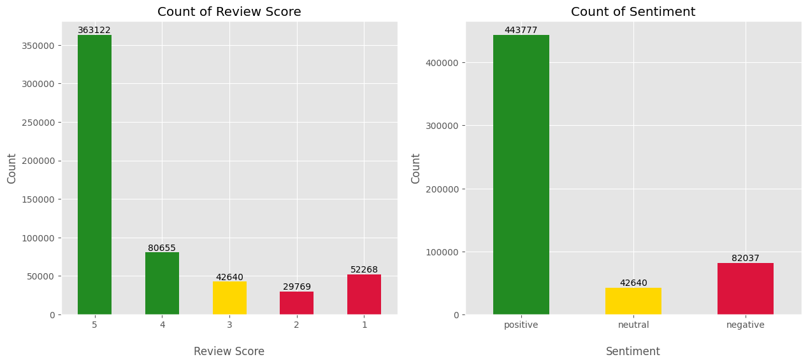
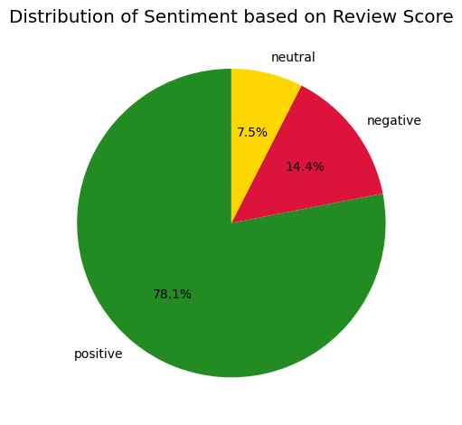
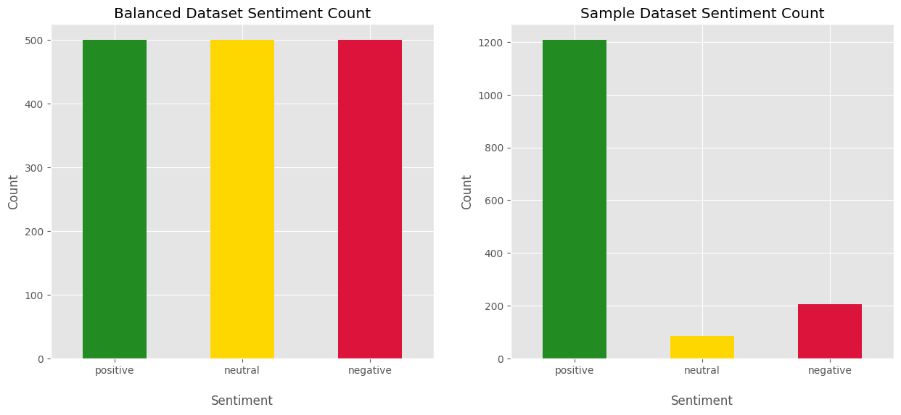
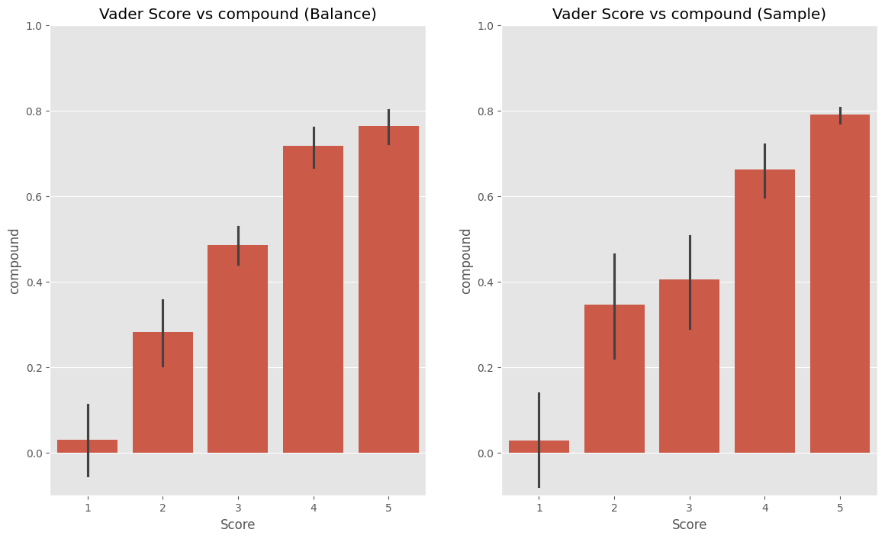
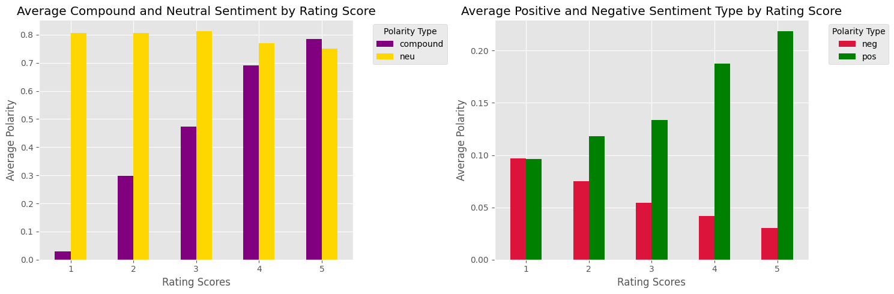
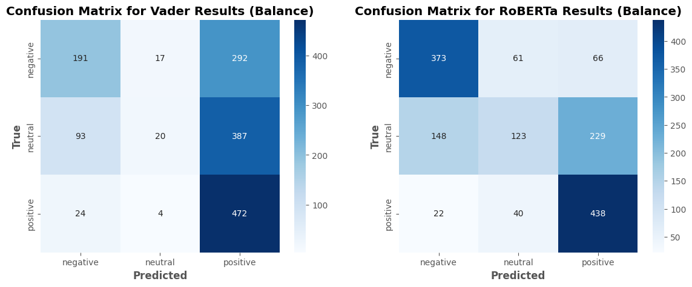
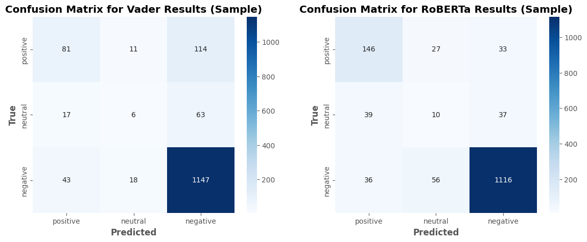

# Amazon Product Sentiment Analysis
## Introduction
This project explores **sentiment analysis** on Amazon product reviews using **balanced** and **sample datasets** to investigate the influence of data distributions on model performance. Sentiment analysis involves classifying customer reviews into **positive**, **neutral**, and **negative** categories.

### Key Highlights:
**⚖️ Balanced Dataset**: Contains equal distributions of sentiments, enabling unbiased comparisons of model accuracy across sentiment types.<br>
**⁒ Sample Dataset**: Reflects real-world distributions, with a higher prevalence of positive reviews, providing insights into performance under naturally imbalanced conditions.<br>
**📍 Objective**: Assess and compare the strengths and limitations of models in handling skewed data distributions, particularly for neutral sentiments.<br>

## Libraries Used
**🔧 Data Manipulation**: `pandas`, `numpy`<br>
**📊 Visualization**: `matplotlib`, `seaborn`<br>
**🗣️ Natural Language Processing**: `nltk`, `transformers`<br>

## Data Preprocessing
The dataset is derived from Amazon product reviews, containing 568,454 records across 10 columns. Key preprocessing steps include:

1. Dropping irrelevant columns (`ProductId`, `UserId`, etc.) to retain only essential fields: `Score`, `Text`, and an additional label column (`TrueLabel`).<br>
2. The TrueLabel column is created by mapping review scores into sentiment labels:
* Scores 1–2 → Negative
* Score 3 → Neutral
* Scores 4–5 → Positive
```python
df['TrueLabel'] = 'neutral'

df.loc[df['Score'].isin([1, 2]), 'TrueLabel'] = 'negative'

df.loc[df['Score'].isin([4, 5]), 'TrueLabel'] = 'positive'
```


<p align="center">
  
</p>

The pie chart above shows that 78.1% of the reviews are classified as positive, while the remaining 21.9% are split between negative and neutral sentiments. The bar chart on the left further supports this, with the 5-star bar having the highest count.<br><br>
With such a large proportion of reviews being positive, there may be an inherent bias in the overall sentiment distribution. This bias could skew analysis or decision-making processes, as the majority sentiment could overshadow the experiences of those who have negative or neutral reviews.<br><br>
This sentiment imbalance could lead to overestimation of the overall satisfaction or effectiveness of the product or service, especially if the positive reviews are overrepresented in the analysis. For example, customer satisfaction metrics may be inflated, masking underlying issues that are reflected in negative or neutral reviews.<br><br>


3. Filtering reviews exceeding 512 tokens, due to RoBERTa model constraints. 6005 reviews were removed.<br>

```python
def filter_tokens(df, text_column, model_name='cardiffnlp/twitter-roberta-base-sentiment', token_limit=512):

    tokenizer = AutoTokenizer.from_pretrained(model_name)

    def token_count(text):
        tokens = tokenizer.encode(text, add_special_tokens=True)  # Add special tokens for the model
        return len(tokens)

    df['token_count'] = df[text_column].apply(token_count)
    filtered_df = df[df['token_count'] <= token_limit]

    filtered_df = filtered_df.drop(columns=['token_count'])

    return filtered_df

filtered_df = filter_tokens(df, 'Text')
```
    
4. Generating two datasets:
* Balanced Dataset: Equal samples of all sentiments.
* Sample Dataset: Randomly sampled records to mimic real-world distribution.<br>



The Balanced Dataset and the Sample Dataset each contain 1500 reviews.<br>

**Balanced Dataset**<br>
The balanced dataset includes 250 reviews each for 1-, 2-, 4-, and 5-star ratings, along with 500 reviews for 3-star ratings.
```python
df1 = filtered_df[filtered_df['Score']==1].sample(250, random_state=42)
df2 = filtered_df[filtered_df['Score']==2].sample(250, random_state=42)
df3 = filtered_df[filtered_df['Score']==3].sample(500, random_state=42)
df4 = filtered_df[filtered_df['Score']==4].sample(250, random_state=42)
df5 = filtered_df[filtered_df['Score']==5].sample(250, random_state=42)

df_balance = pd.concat([df1, df2, df3, df4, df5])
```

**Sample Dataset**<br>
The sample dataset contains a random sample of 1500 reviews from the filtered dataset. <br>
```python
df_sample = filtered_df.sample(1500, random_state=42)
```

## Model 1: VADER (Valence Aware Dictionary and sEntiment Reasoner)

NLTK's SentimentIntensityAnalyzer obtains the neg/neu/pos scores of the text.<br>

The VADER model is a specialized sentiment analysis tool designed to analyze text, particularly in social media, by evaluating the sentiment expressed in a piece of text. It uses a lexicon of words that are associated with positive, negative, and neutral sentiments, allowing it to assign sentiment scores to texts based on the presence of these words and their context. VADER is particularly effective for short texts, such as product reviews, due to its ability to consider sentiment-laden terms and their modifiers (like "very" or "not").<br>

The VADER model is applied to each review in the datasets (`df_balance` and `df_sample`) to generate sentiment scores. Each score includes:

* **Positive Score**: Indicates the degree of positivity in the text.
* **Negative Score**: Indicates the degree of negativity in the text.
* **Neutral Score**: Indicates the degree of neutrality in the text.
* **Compound Score**: A normalized score ranging from -1 (most negative) to +1 (most positive) that summarizes the overall sentiment. This is measured by the `SentimentIntensity Analyzer` aka `sia` function from `nltk.sentiment` and the `sia.polarity_scores()` method from nltk for each review.

### Building Vader Models:

**Vader Balanced Dataset**
```python
results = {}

for i, row in tqdm(df_balance.iterrows(), total=len(df_balance)):
    text = row['Text']
    id = row['Id']
    results[id] = sia.polarity_scores(text)
```

**Vader Sample Dataset**
```python
results = {}
for i, row in tqdm(df_sample.iterrows(), total=len(df_sample)):
    text = row['Text']
    id = row['Id']
    results[id] = sia.polarity_scores(text)
```

### Vader Model Results


The average compound score in both the balanced and sample datasets increase as the Score increases.


On the left graph, the average compound score increases as the Rating Scores increase, which is expected. However, the neutral score seems to remain flat.<br><br>
On the right graph, the average negative polarity decreases as the Rating Scores increase, and the average positive polarity increases as the Rating Scores increase, which is also expected.

## Model 2: ROBERTA

The RoBERTa model, a refined version of BERT (Bidirectional Encoder Representations from Transformers), is a transformer-based model developed by Facebook AI for improved natural language understanding. Trained on a larger corpus and using a more robust pretraining process than BERT, RoBERTa excels at tasks like sentiment analysis, where it can capture nuanced language patterns, context, and subtle cues in text.<br>

For the Amazon product review dataset, the RoBERTa pre-trained model `cardiffnlp/twitter-roberta-base-sentiment` is used to classify reviews as positive, neutral, or negative. By processing each review through RoBERTa’s tokenizer and sequence classification layers, the model generates sentiment scores that can reveal overall customer satisfaction. These insights are useful for understanding customer preferences, identifying potential product issues, and guiding business decisions based on customer feedback.

### Building RoBERTa Model using Transformer's Sentiment-Analysis Pipeline
```python
# Defining appropriate parameters for the transformer's sentiment-analysis pipeline
tokenizer = AutoTokenizer.from_pretrained(model_name, clean_up_tokenization_spaces=True)
sentiment_pipeline = pipeline('sentiment-analysis', f"cardiffnlp/twitter-roberta-base-sentiment",
                              tokenizer=tokenizer)

# Defining get_sentement function to rename the original labels to 'negative', 'neutral', and 'positive'
def get_sentiment(text):
    result = sentiment_pipeline(text)
    label_map = {'LABEL_0': 'negative',
                 'LABEL_1': 'neutral',
                 'LABEL_2': 'positive'}
    result[0]['label'] = label_map[result[0]['label']]
    return result[0]
```

## Confusion Matrices


```
Classification Report for Vader Results (Balance)
              precision    recall  f1-score   support

    negative       0.62      0.38      0.47       500
     neutral       0.49      0.04      0.07       500
    positive       0.41      0.94      0.57       500

    accuracy                           0.46      1500
   macro avg       0.51      0.46      0.37      1500
weighted avg       0.51      0.46      0.37      1500

Classification Report for RoBERTa Results (Balance)
              precision    recall  f1-score   support

    negative       0.69      0.75      0.72       500
     neutral       0.55      0.25      0.34       500
    positive       0.60      0.88      0.71       500

    accuracy                           0.62      1500
   macro avg       0.61      0.62      0.59      1500
weighted avg       0.61      0.62      0.59      1500
```




```
Classification Report for Vader Results (Sample)
              precision    recall  f1-score   support

    negative       0.57      0.39      0.47       206
     neutral       0.17      0.07      0.10        86
    positive       0.87      0.95      0.91      1208

    accuracy                           0.82      1500
   macro avg       0.54      0.47      0.49      1500
weighted avg       0.79      0.82      0.80      1500


Classification Report for RoBERTa Results (Sample)
              precision    recall  f1-score   support

    negative       0.66      0.71      0.68       206
     neutral       0.11      0.12      0.11        86
    positive       0.94      0.92      0.93      1208

    accuracy                           0.85      1500
   macro avg       0.57      0.58      0.58      1500
weighted avg       0.85      0.85      0.85      1500
```


## Comparison

The classification reports for VADER and RoBERTa on the balanced and sampled Amazon product datasets reveal distinct strengths and limitations for each model:<br>

**VADER Performance**:<br>

**Balanced Dataset**: VADER struggles with neutral reviews, achieving low precision, recall, and F1-scores, suggesting difficulty in detecting moderately toned sentiments. Positive sentiment, however, shows a high recall but at the cost of lower precision, indicating that VADER may overclassify reviews as positive.<br>
**Sampled Dataset**: VADER's performance on the imbalanced sample shows high precision and recall for positive sentiment but limited ability to differentiate neutral reviews, evident in the significant drop in F1-score. Accuracy is higher due to the model’s positive sentiment bias, likely due to the large number of positive samples.<br><br>

**RoBERTa Performance**:<br>

**Balanced Dataset**: RoBERTa generally outperforms VADER, especially in detecting negative and positive sentiments with stronger precision and recall. However, it too struggles with neutral reviews, achieving only a modest F1-score. Accuracy of 62% shows it performs better than VADER overall.<br>
**Sampled Dataset**: RoBERTa’s precision and recall for positive and negative sentiments remain high, while its neutral detection remains challenging. The model achieves high accuracy here, aided by the abundance of positive samples.<br><br>

## Conclusion

**Neutral Detection**: Both models have trouble identifying neutral sentiment, with significantly lower F1-scores for neutral reviews across datasets. This suggests that detecting moderate sentiments is complex, possibly due to subtle language cues.<br>
**Impact of Dataset Imbalance**: In the sampled dataset, both models show an increase in overall accuracy, but this may mask challenges in identifying less frequent sentiments, such as neutral and negative. For a more balanced performance, additional training or fine-tuning on neutral-dominant data could be beneficial.<br>

RoBERTa provides a more robust classification than VADER on balanced data, especially for negative and positive reviews, but both models struggle with neutral sentiment, likely due to subtler language cues and dataset imbalance.<br>

More details can be found in the `vader_vs_roberta.ipynb` that include text breakdown and an analysis on false positive/negative reviews for both VADER and RoBERTa models.

